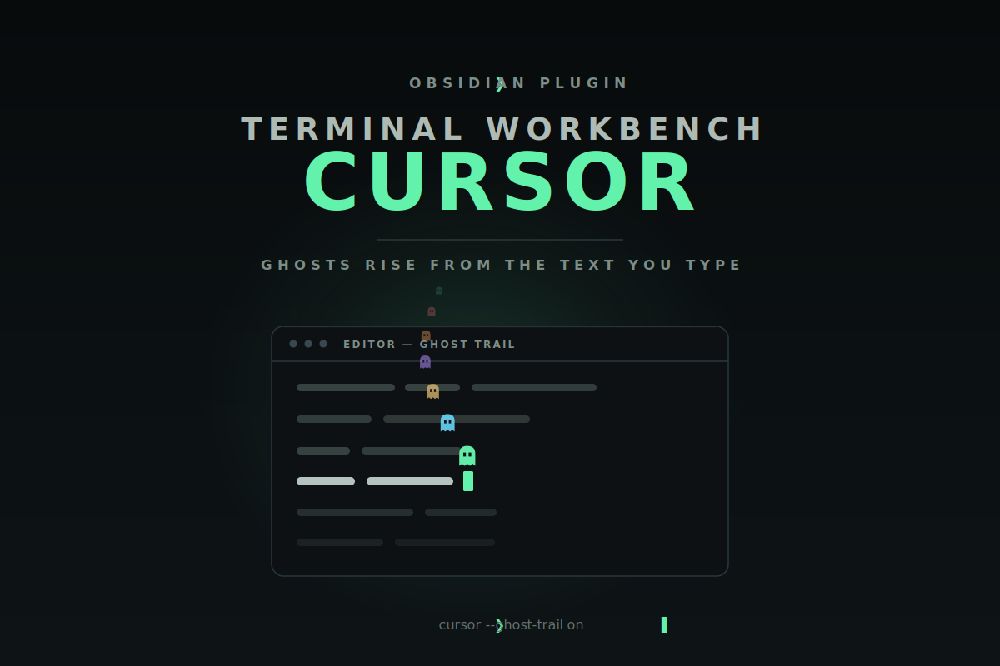

<div align="center">

  

  **A cursor engine for the Terminal Workbench family — box, line, and underline carets, a torch spotlight, and a Ghost Trail that peels a little ghost off the text as you type.**

  [](LICENSE)
  [](https://github.com/Real-Fruit-Snacks/terminal-workbench-cursor/releases)
  [](https://obsidian.md)

  [Documentation](https://real-fruit-snacks.github.io/terminal-workbench-cursor/) · [Changelog](CHANGELOG.md) · [Report an issue](https://github.com/Real-Fruit-Snacks/terminal-workbench-cursor/issues)

</div>

---

## Overview

Terminal Workbench Cursor replaces Obsidian's editor caret with a small canvas
engine. Choose a box, line, or underline cursor; give it smooth gliding motion, a
blink, or a glow; carry a torch spotlight around the workspace; and layer on
effects — a fading pixel trail, motion smear, a CRT trail, an energy beam.

Its headline addition to the family is the **Ghost Trail**: a miniature
[Terminal Workbench Pet](https://github.com/Real-Fruit-Snacks/terminal-workbench-pet)
ghost peels off the text as you type — and, if you like, off the caret as it
moves — then rises, drifts, and fades. Colours come from the
[Terminal Workbench](https://github.com/Real-Fruit-Snacks/terminal-workbench-design-system)
accent ramp, and every effect is individually toggleable in settings.

## Features

- **Ghost Trail** — a Terminal Workbench Pet ghost spawns from typed characters
  and, optionally, cursor movement; it rises, drifts, and fades. Triggers,
  density, size, rise speed, drift, lifetime, opacity, and colour mode
  (accent / cycle palette / match cursor) are all adjustable. Off by default.
- **Cursor styles** — Box, Line, and Underline, with smooth gliding motion,
  adjustable width, opacity, glow, and blink.
- **Torch spotlight** — dim the workspace and follow the caret or pointer with a
  soft pool of light; runs alongside any cursor style.
- **More effects** — popping letters, a fading pixel trail, motion smear, a
  cursor trail (afterimage), and an energy beam, each independently tunable.
- **Terminal Workbench integration** — cursor and ghost colours resolve from the
  `--twb-*` accent ramp, with graceful hex fallbacks when the theme is absent, so
  it looks native under the theme and clean without it. The settings panel is
  restyled in the terminal idiom.
- **Opt-in effects** — Ghost Trail ships off, and every effect is individually
  toggleable, so you decide exactly how much motion you want.

## Ghost Trail

Enable it under **Settings → Terminal Workbench Cursor → Effects → Ghost Trail**.
Choose whether ghosts spawn on typing, on cursor movement, or both; set the
density, size, rise speed, drift, lifetime, and opacity; and pick a colour mode —
hold one accent, cycle the palette, or match your cursor.

## Install

**Manual (recommended)** — download `main.js`, `manifest.json`, `styles.css`, and
`versions.json` from the
[latest release](https://github.com/Real-Fruit-Snacks/terminal-workbench-cursor/releases/latest),
place them in `<vault>/.obsidian/plugins/terminal-workbench-cursor/`, and enable
**Terminal Workbench Cursor** in Community plugins.

**BRAT** — add the beta plugin `Real-Fruit-Snacks/terminal-workbench-cursor` in
[BRAT](https://github.com/TfTHacker/obsidian42-brat), then enable it.

## The Terminal Workbench family

- [Terminal Workbench design system](https://github.com/Real-Fruit-Snacks/terminal-workbench-design-system) — the shared theme spec and `--twb-*` tokens.
- [Terminal Workbench Pet](https://github.com/Real-Fruit-Snacks/terminal-workbench-pet) — the floating ghost companion whose sprite the Ghost Trail borrows.

## Development

The plugin is plain JavaScript with no build step — a single self-contained
`main.js`. The pure Ghost Trail helpers (ghost SVG, palette resolution, physics,
throttle) are mirrored in `ghost-core.js`, which is the unit-tested reference for
that logic:

```bash
npm test
```

## Credits

Forged from [cursor-smith](https://github.com/Sadsnake1/cursor-smith) by Sadsnake1
(MIT). The Ghost Trail renders the ghost from
[Terminal Workbench Pet](https://github.com/Real-Fruit-Snacks/terminal-workbench-pet).
See [`docs/CREDITS.md`](docs/CREDITS.md) and [`LICENSE`](LICENSE).

## License

MIT © 2026 Real-Fruit-Snacks. Portions © Sadsnake1 (cursor-smith), MIT.
